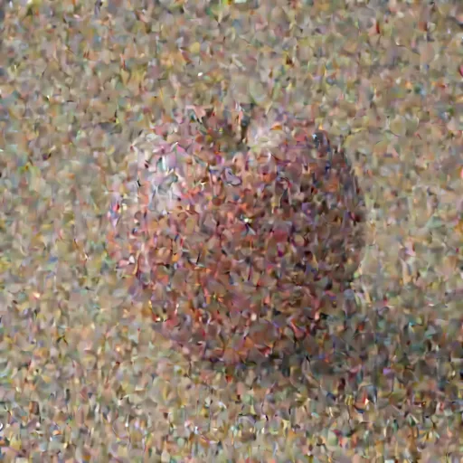
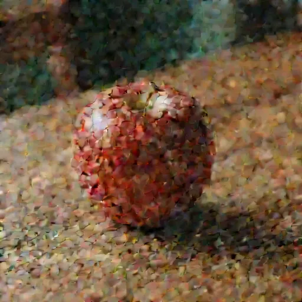
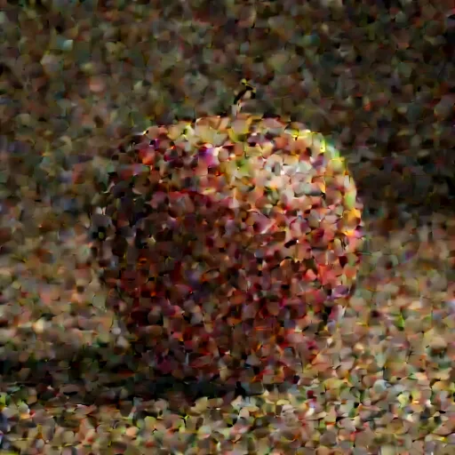
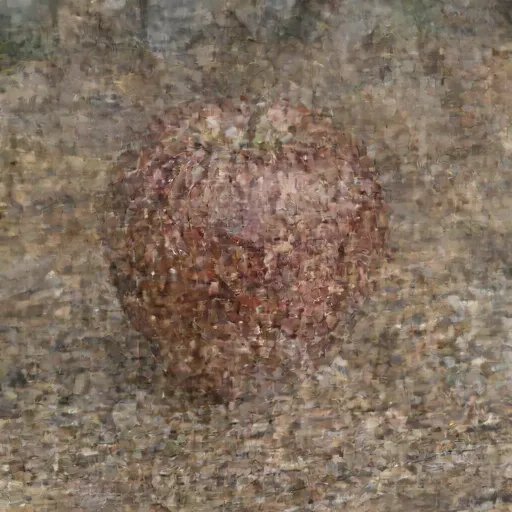
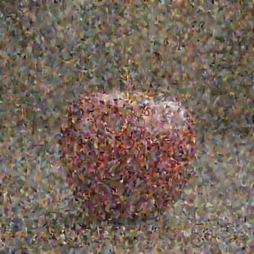
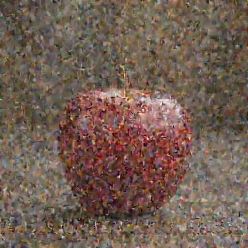

# Examples

Worked examples of mlx-taef in use, each with captured live-preview frames and a reproduce command.
Most also carry the measured cost of each decode against the full VAE; Qwen-Image and Krea 2 are
decode-verified against committed parity fixtures and SSIM gates instead, with their in-context
decode-timing benchmark still pending (those sections explain why). The point of a tiny autoencoder
is to watch a diffusion run progress without paying for the full VAE on every step, so most of these
are live-preview walkthroughs. A separate section covers the SD1.x/SDXL side of the family. TAESD
and TAESDXL don't have an mflux generation model to preview, so their example is an encode/decode
roundtrip on a still photo instead.

Every measured number below was produced by the committed bench harness and is reproducible with
the command shown in its section, except where a section marks its figures as pending or
community-measured. Captures and timings: Apple M1 Max, 32 GB unified memory, macOS;
mflux 0.18.1, MLX 0.31.2; weights quantized to int4 (`quantize=4`), bf16 generation and fp32 decode. Decode
times measure the decode step in isolation, outside of model construction and after one untimed
warmup call, as the median over several timed reps — the steady-state per-step cost a live preview
pays after its first step. SSIM compares the tiny-decoder image against the full VAE on the same
latent. Captured for mlx-taef v0.7.1-8-g28af6c5 at commit `28af6c5` on 2026-08-09, on CPython 3.13.12.

Runnable scripts live in [`examples/`](examples/).

## Z-Image-Turbo live preview

Z-Image-Turbo's VAE shares FLUX.1's 16-channel latent contract, so the existing TAEF1 decoder
previews it with no new weights to download. This is the fastest preview in the set.

Recipe: Z-Image-Turbo, prompt `"a red apple on a wooden table"`, seed 42, 512×512, 4 steps,
guidance 0.0 (Turbo is distilled and ignores guidance), int4. Script:
[`examples/zimage_live_preview.py`](examples/zimage_live_preview.py).

Mid-denoise previews (steps 1, 3, final):

| step 1 | step 3 | final |
|---|---|---|
|  |  |  |

What happened: the callback decodes the in-flight latent every step with TAEF1 and writes a
preview frame, while mflux finishes the run and decodes the final image with the full Z-Image
VAE. By step 1 the composition is already readable.

The gain: decoding the final Z-Image latent takes **30 ms** with TAEF1 versus **0.24 s** with the
full Z-Image VAE, about **8.0× faster**, and it peaks at **0.55 GB** instead of 2.61 GB. Structural
similarity between the two is **SSIM 0.94**, so the preview tracks the real image closely. The
TAEF1 decoder is a few MB; the full VAE is hundreds. Reproduce:

```
uv run python scripts/run_showcase.py --scenario zimage_vs_vae
```

A note on scope: Z-Image support is validated for decode, live preview, and encode, each against
its own opt-in network test (`pytest --run-network`), and none of those tests run in default CI.
The showcase command above measures the decode SSIM number, guarded by the same ≥ 0.75 contract
against the full Z-Image VAE. `ZImage` inherits the full API including `encode()`, which reuses
the TAEF1 encoder on the shared latent contract and is validated by its own opt-in cross-roundtrip
gate (TAEF1-encode -> full Z-Image VAE decode, SSIM >= 0.75, measured 0.9580).

## Qwen-Image live preview

Qwen-Image and Qwen-Image-Edit generate in the Wan 2.1 VAE's 16-channel latent space, which the
rest of the TAESD family doesn't cover. `QwenImage` ports madebyollin's taew2.1 tiny autoencoder
for it, so `LivePreviewCallback(variant="qwen-image")` previews an in-flight Qwen generation the
same way the other variants do:

```python
from mlx_taef.integrations.mflux import LivePreviewCallback

callback = LivePreviewCallback(variant="qwen-image", save_to="preview.png", every=5)
# pass `callback` to your mflux Qwen-Image generation
```

Correctness is gated by committed parity fixtures: the decode and encode paths match the upstream
taew2.1 reference to within ~3e-6 (fp32).

Recipe: Qwen-Image, prompt `"a red apple on a wooden table"`, seed 42, 512×512, 20 steps (mflux's
own CLI default for this model), guidance 3.5, M1 Max. The build uses the published
mixed-precision recipe (bf16 for a few embedding/output modules, 8-bit for the transformer's
first and last six blocks, 4-bit for the rest) instead of plain `quantize=4`, which removes a
reticulated skin-texture artifact the uniform-int4 build shows on this model:
https://ineshin.space/papers/qwen-image-mixed-precision-on-a-32-gb-mac/. Reproduce:

```
uv run python scripts/capture_examples.py --variant qwen-image
```

| step 14 | step 18 | final |
|---|---|---|
|  |  |  |

The taew2.1 preview stays undifferentiated noise through roughly the first half of this 20-step
run: steps 2 and 10 both show nothing. The apple starts resolving around step 12, step 14
(pictured) is already a rough but recognizable shape, and step 18 is close to the final image.
Structure emerges later here than in every other variant in this document, so a live preview
registered on Qwen-Image earns its keep mainly in the back half of a run.

Qwen-Image is a ~20B model: running it back to back with the other captures in one chained pass
hit a Metal command-buffer out-of-memory error, and the frames above came from rerunning that one
capture on its own instead. The `mlx-taef bench --variant qwen-image` decode-timing number is
still community-measured rather than captured on this reference machine.

## Krea 2 live preview

Krea 2 Turbo generates on the Qwen-Image stack and shares its Wan 2.1 VAE, so `Krea2` decodes
through the same taew2.1 tiny autoencoder as `QwenImage` — one shared converted-weights cache
entry, no separate download:

```python
from mlx_taef import Krea2

taef = Krea2.from_pretrained(include_encoder=False)
preview = taef.decode_image(unpacked_latent)  # uint8 NHWC
```

```python
from mlx_taef.integrations.mflux import LivePreviewCallback

callback = LivePreviewCallback(variant="krea2", save_to="preview.png", every=5)
# pass `callback` to your mflux Krea 2 generation
```

Correctness is gated the same way as Qwen-Image: decoding the committed (red apple, seed 42) Krea 2
latent through `Krea2` and comparing it against mflux's full Krea 2 VAE scores **SSIM 0.9678**
(`tests/test_krea2_ssim.py`, opt-in network test, ≥ 0.75 threshold).

Recipe: Krea 2 Turbo, prompt `"a red apple on a wooden table"`, seed 42, 512×512, 8 steps
(`krea2_generate.py`'s own default), guidance 1.0, int4, M1 Max. Reproduce:

```
uv run python scripts/capture_examples.py --variant krea-2-turbo
```

| step 4 | step 6 | final |
|---|---|---|
|  |  |  |

Krea 2's 8-step schedule stays noise through step 3 with this decoder, then resolves fast: step 4
is the first frame with a recognizable apple, and step 6 is already close to the final image.

A note on scope: this page doesn't carry a separate Krea 2 decode-timing benchmark. `Krea2` and
`QwenImage` share byte-identical taew2.1 weights — one converted-cache entry, keyed by role rather
than model name — so a Krea 2 decode timing would just be Qwen-Image's decode timing measured a
second time. The `mlx-taef bench --variant krea2` number is community-measured rather than
captured on this reference machine, for the same reason Qwen-Image's is.

## FLUX.2 Klein live preview

A live preview of FLUX.2 Klein with `auto_bn` color correction. Pass `flux=model` and the
callback reads the VAE's batch-norm stats so the previews are color-correct from the first step.
The `auto_bn` API itself is demonstrated against FLUX.2 Klein base 4B in
[`examples/mflux_live_preview.py`](examples/mflux_live_preview.py); the frames pictured below are
from the distilled 4B Klein instead (its own native 4-step schedule, no separate `--steps` flag to
set).

Recipe: FLUX.2 Klein 4B (distilled), prompt `"a red apple on a wooden table"`, seed 42, 512×512, 4
steps (native), guidance 1.0 (fixed for this distilled config), int4, M1 Max. Reproduce:

```
uv run python scripts/capture_examples.py --variant flux2-klein-4b
```

| step 2 | step 3 | final |
|---|---|---|
|  |  |  |

The gain: TAEF2 decodes a Klein latent in **30 ms** versus **0.28 s** for the full FLUX.2 VAE
(~9.4× faster), at **0.59 GB** versus 2.80 GB peak. SSIM here is **0.616**, lower than the FLUX.1
family because TAEF2 is a 4 MB preview decoder standing in for a ~340 MB VAE: it keeps the
structure and color and fudges fine detail. That is the deliberate trade for a real-time preview;
reach for the full VAE when you need final-quality fidelity. This benchmark itself runs on FLUX.2
Klein base 4B at a fixed 4-step timing recipe, not the distilled 4B pictured above. The decoder
being measured is the same TAEF2 either way, so the number holds regardless of which Klein config
produced the latent. Reproduce:

```
uv run python scripts/run_showcase.py --scenario taef2_vs_vae
```

## FLUX.1 fast decode

TAEF1's architecture is closer to the FLUX.1 VAE it shadows, so its previews are higher fidelity
than the FLUX.2 pair.

Recipe: FLUX.1-dev, prompt `"a red apple on a wooden table"`, seed 42, 512×512, 14 steps, guidance
3.5, int4, M1 Max. Reproduce:

```
uv run python scripts/capture_examples.py --variant flux1-dev
```

| step 6 | step 7 | final |
|---|---|---|
|  |  |  |

FLUX.1-dev's 14-step schedule stays undifferentiated TAEF1 noise through step 5; step 6, pictured
here, is the earliest frame with a visible (if faint) red patch. Structure emerges later in this
run than in the Z-Image or Klein galleries above, which fits: 14 steps is a slower, non-distilled
schedule.

Same red-apple latent, two decoders:

| Full FLUX.1 VAE | TAEF1 |
|---|---|
|  |  |

TAEF1 decodes the same latent in **29 ms** versus **0.30 s** for the full FLUX.1 VAE (~10.2× faster),
at **0.55 GB** versus 3.67 GB peak and **SSIM 0.94**. Reproduce:

```
uv run python scripts/run_showcase.py --scenario taef1_vs_vae
```

## TAESD / TAESDXL roundtrip

TAESD and TAESDXL preview SD1.x and SDXL latents, and neither model has an mflux generation path in
this repo to run a live preview against. Their example is an encode/decode roundtrip instead: load
a still photo, encode it with the tiny autoencoder's own encoder, decode the result back, and
compare against the source.

Recipe: same 512×512 input photo for both, `include_encoder=True`, fp32 encode/decode (no mflux
generation or quantization involved here), M1 Max. Reproduce:

```
uv run python scripts/capture_examples.py --variant taesd-roundtrip --input <path>
uv run python scripts/capture_examples.py --variant taesdxl-roundtrip --input <path>
```

| input | TAESD roundtrip | TAESDXL roundtrip |
|---|---|---|
|  |  |  |

TAESD keeps the apple's shape and color but visibly softens the fine skin texture and blurs the
specular highlight compared to the input. TAESDXL keeps the highlight sharper but introduces a
fine mottled, stippled texture across the apple's skin that isn't in the source — a different
failure mode (added noise) rather than a strictly closer reproduction.

## Low-memory decode

The memory story is the other half of the point. Across all three models the tiny decoder peaks
at roughly half a gigabyte (0.55–0.59 GB), while the full VAEs run 2.6–3.7 GB. On a 32 GB Mac shared
between the OS, the diffusion model, and the decoder, that headroom is what lets a preview run
alongside generation without tipping into swap. If you only need to inspect a latent rather than
ship a final image, decoding it with the matching TAEF variant avoids loading the multi-GB VAE.

## Combined with TeaCache

The preview callback and [mlx-teacache](https://github.com/IonDen/mlx-teacache) coexist on the
same mflux callback registry, so you can cache transformer steps and watch the preview at once.

| step 1 | step 3 | final |
|---|---|---|
|  |  |  |

Recipe: FLUX.2 Klein base 4B with TeaCache applied, TAEF2 live preview, same prompt/seed/steps.
Reproduce:

```
uv run python scripts/run_showcase.py --scenario combined
```
